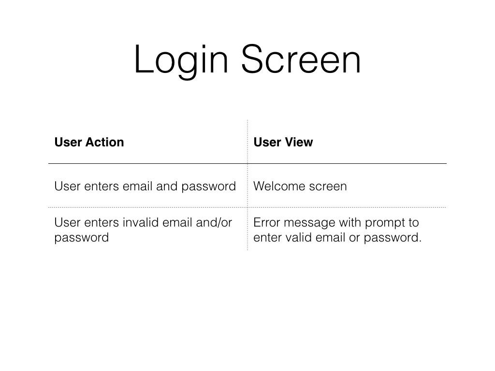
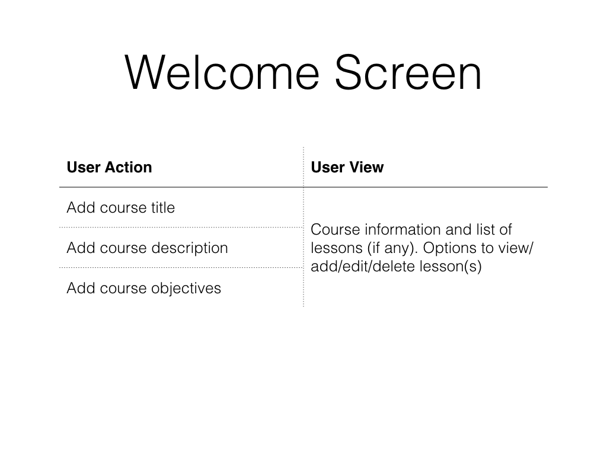
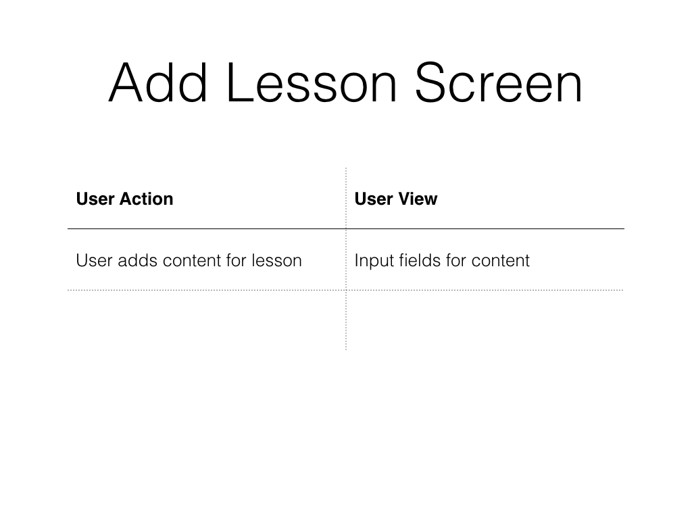
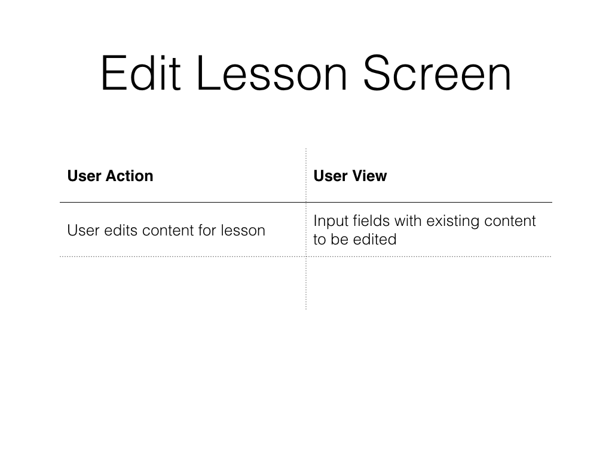
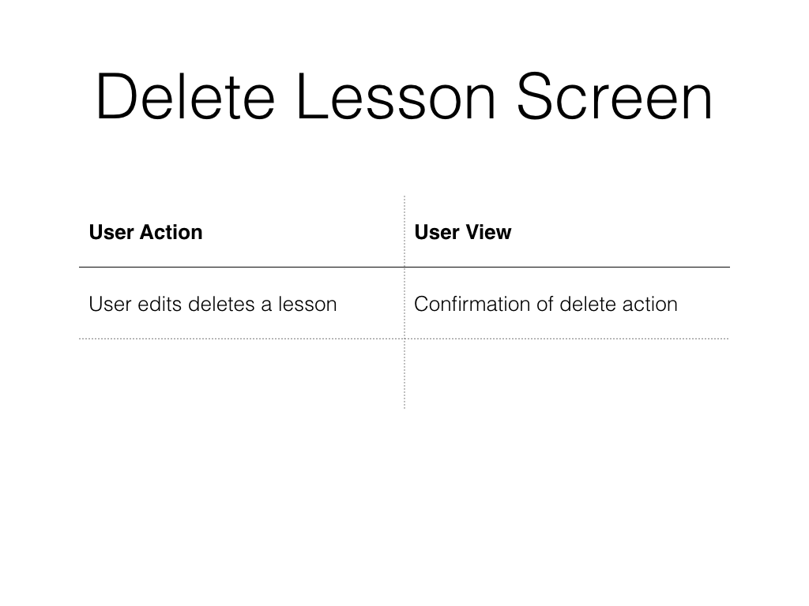
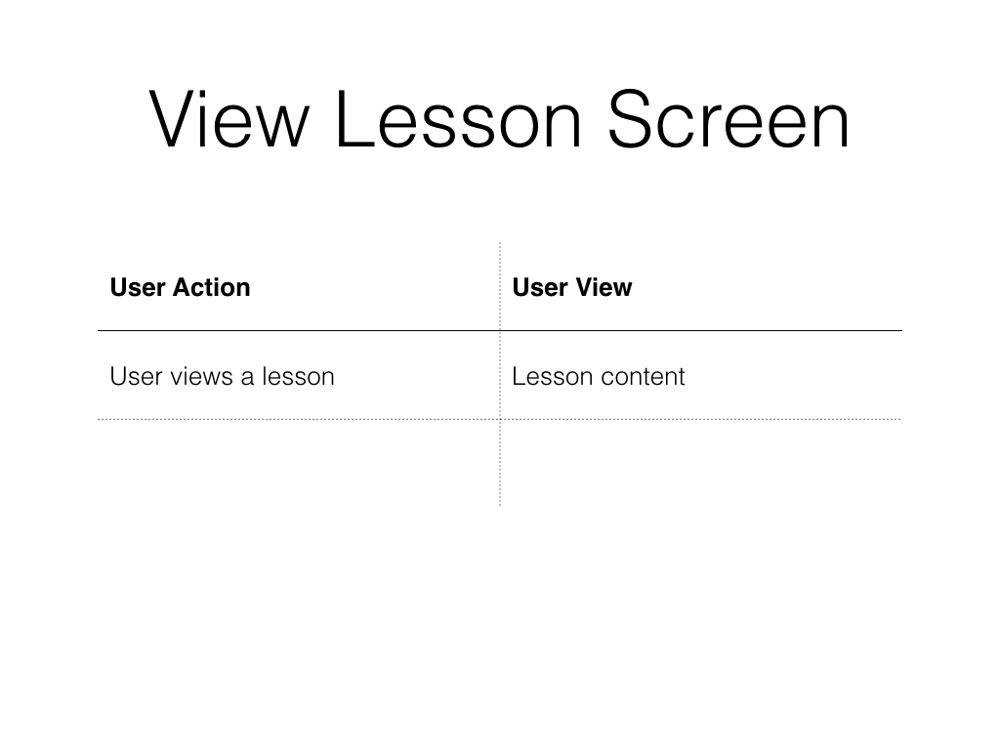

# Node LMS MVP Design

## Short list user stories

* A user should be able to login using an email address and password.
* A user should be able to add information about a course, e.g., description, title.
* A user should be able to create lesson content using markdown.
* A user should be able to view lesson content that was created.
* A user should be able to add image URLs (i.e., hot linked) to lessons.
* A user should be able to add URLs for embeddable content (e.g., videos, audio) to lessons.
* A user should be able to delete lessons.
* A user should be able to edit existing lessons.

## Screens

* screen to login
* screen that displays list of lessons
* screen to add lesson
* screen to edit lesson
* screen to delete lesson
* screen to view lesson

## User flows

